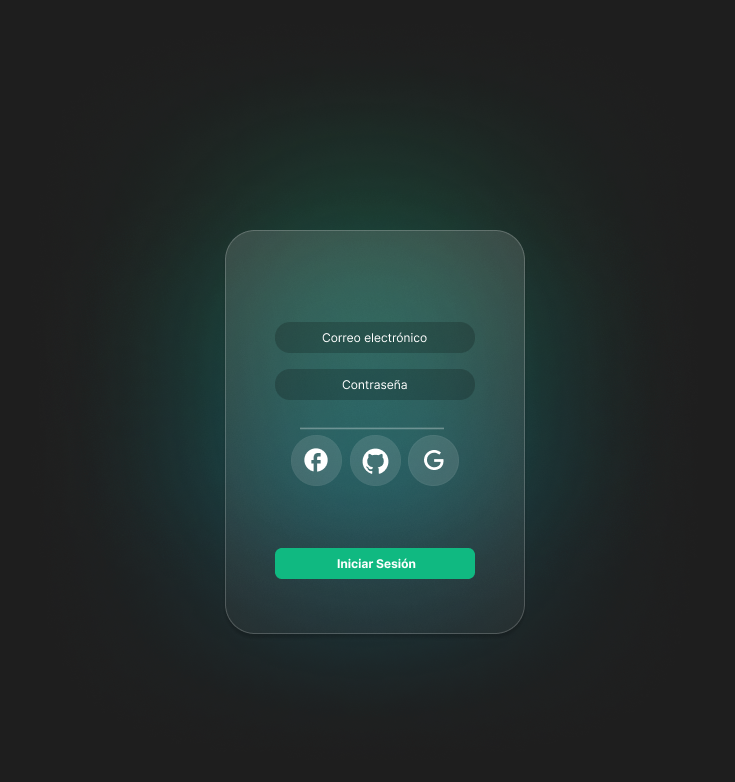
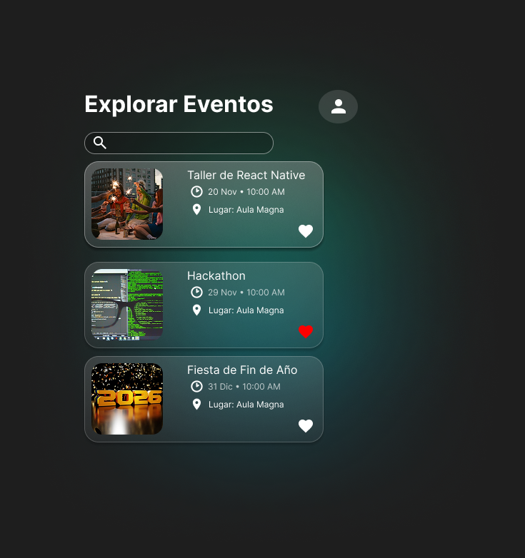
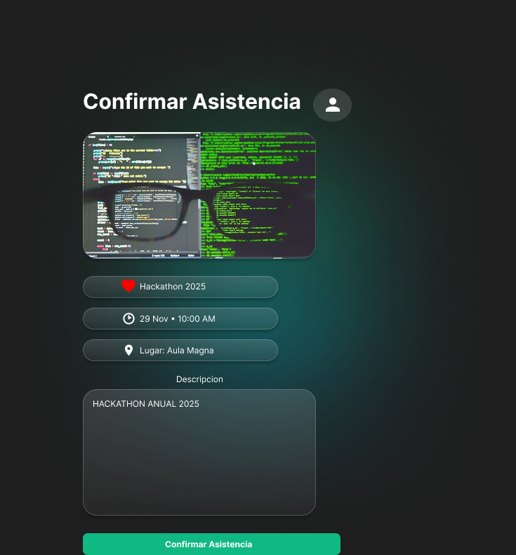

# 📱 Aplicación de Gestión de Eventos Comunitarios

## 👥 Integrantes del Equipo
* **[Rolando Giovanni Guevara Martir GM202436]**
* **[Ronald Vladimir Urias Orellana RO230537]** 

## 🔗 Enlaces de Gestión
* **Tablero de Trello:** https://trello.com/b/IodGEvoq/tarea-dps-proyecto-2-gm202436
* **Diseños UX/UI (Figma):** Ver carpeta `/assets/design` en este repositorio.

## 🎨 Mockups del Proyecto
Aquí presentamos la propuesta visual de la aplicación:

## 📄 Licencia
Este proyecto utiliza la licencia **Creative Commons Attribution 4.0 International (CC BY 4.0)**.